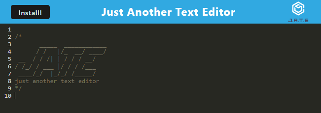
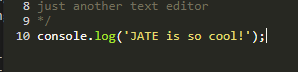
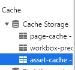
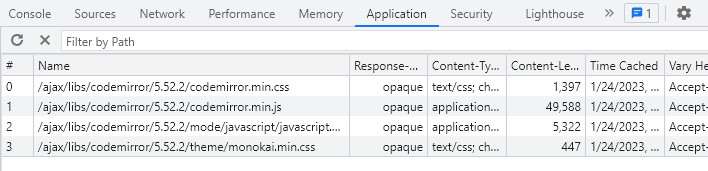

# Week 19: Progressive Web App Text Editor

## Description

For the 19th week in our coding bootcamp we were tasked with configuring a webpack file along with a service worker for a partially complete web based text editor. We were to utilize Webpack and a number of its plugins to bundle a development build into something much more condensed, and these packaged files were to be cached at the user's request using an InjectManifest service worker. Finally, the actual content of the text editor was stored using IndexedDB.

At first it was kind of difficult to take inventory and it wasn't too clear what should get knocked out first. Should establishing an `idb` database get done first so our app can store and read data, and would a service worker need to have that logic complete before it could inject? Or could it be the other way around? What I eventually decided was at the top of the hierarchy was the `webpack.config.js` file itself. It wasn't too bad to get all the options set just right, I had to snoop around `./src/index.js` to find out what exactly to name the injected service worker. I looked around online for examples of other's webpack.config files to figure out how to adjust options like excluding bundle fingerprints, but overall it didn't deviate too heavily from the practice we got during class.

Next were the install button functions and the database calls. The functions for the cache install button itself was entirely boilerplate and wasn't a problem at all. The database calls, however, were the source of most of my grief. Not because the syntax is radically complicated or anything, it's a big long winded sure but it's readable. I got a number of errors because for some reason if I returned the results of a GET call, the data populator functions would break. If the GET call never returns anything but instead stores the results in a variable, then it works just fine. I'd be very interested in figuring out why that was the case.

Lastly there was the service worker itself, specifically the function to cache assets when the users chooses to install the assets into localstorage. Luckily it was just a single function and the only complicated aspect was finding the correct method, which turned out to be `CacheFirst`. It feels awfully hands off telling webpack to just vaguely pack `"style" "script"` and `"worker"` files but in the scope of this project that's fine to cache everything.

## Installation

Application already to deployed to Heroku [here.](https://fathomless-ocean-60654.herokuapp.com/)

To download the project for testing or reference, run `npm install` in the root folder once the repo is cloned to your machine. To begin hosting the app at `localhost:3000` (3000 being the default port defined in `./server/server.js`) run `npm run start` to both build and spool up the local server. For a full list of available npm commands, view the `./package.json` dev commands.

## Usage

- Upon loading the app, a placeholder logo will occupy the first few lines. Feel free to clear it from the editor.

- To enter text, simply click the start of a line and begin typing as if it were any other text editor.

- Your entries will be automatically saved using IndexedDB in local storage. Whatever you enter will persist between reloads.

- To install app assets in a cache, click the `Install!` button and confirm any following prompts.

- You can view the asset cache using Chrome dev tools.

## License

Standard MIT License, classwork.\
Starter code provided by the University of Minnesota Coding Bootcamp.\
This project is deployed using [Heroku.](https://www.heroku.com/platform)
